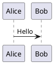
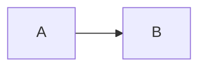

# Notepad Viewer Plus for Notepad++

## Plan and Architecture — Optimized Edition

> Historical Phase 1 plan for the Markdown-only baseline. The current product is Notepad Viewer Plus; see `PHASE-2-MULTI-FORMAT-PLAN.md` and `README.md` for current behavior, packaging, and supported architectures.

**Status:** Initial x64 release implemented and validated  
**Implementation status:** Renderer, native WebView2 host, native tests, packaging, local Notepad++ smoke testing, and the 0.1.5 panel/shortcut/table-of-contents UX follow-up completed  
**Primary platform:** Windows / Notepad++  
**Recommended implementation:** Native C++ plugin with an embedded WebView2 preview

## 1. Executive summary

Notepad Viewer Plus started as a lightweight Notepad++ plugin that renders the active Markdown document in a browser-friendly docked preview. In addition to normal Markdown, it will support:

- PlantUML fenced blocks
- Mermaid fenced blocks
- KaTeX mathematics
- GitHub, container, and MkDocs-style admonitions
- YAML front matter
- Syntax-highlighted fenced code blocks

The Optimized Edition prioritizes a small distribution and low startup overhead while remaining fully offline at runtime. It will use:

- A thin native C++ Notepad++ plugin
- The shared Microsoft Edge WebView2 Evergreen Runtime
- A bundled TypeScript renderer
- `@plantuml/core` with only required runtime assets
- Mermaid Tiny instead of full Mermaid
- KaTeX with only browser WOFF2 fonts
- Highlight.js core with an explicit language allowlist
- Lazy loading for PlantUML, Mermaid, KaTeX, and syntax highlighting

No Node.js, Java runtime, PlantUML server, Graphviz executable, CDN, or localhost HTTP server will be required at runtime.

### Size targets

The size budget applies to each architecture-specific release package, rather than combining x64 and x86 binaries in one archive.

| Artifact | Target | Warning threshold |
|---|---:|---:|
| Release ZIP | 4–7 MB | 8 MB |
| Installed plugin folder | 12–18 MB | 20 MB |
| Initial renderer payload, excluding lazy chunks | Less than 500 KB compressed | 750 KB |

The package will be larger than 3 MB because the PlantUML JavaScript engine and Viz.js layout engine alone approach that size when compressed. WebView2 itself is not bundled and is therefore not included in these estimates.

## 2. Goals

### 2.1 Functional goals

1. Show an embedded, dockable live preview for the active Notepad++ document.
2. Render standard Markdown predictably and safely.
3. Render the following fenced blocks:
   - `plantuml`
   - `puml`
   - `mermaid`
   - normal programming-language fences
4. Render inline and display mathematics through KaTeX.
5. Support common admonition formats.
6. Parse and display YAML front matter.
7. Resolve safe relative images and links.
8. Support light, dark, and system themes.
9. Continue rendering the rest of a document when one diagram or expression is invalid.
10. Work offline after installation.
11. Provide an optional generated table of contents for Markdown headings.

### 2.2 Non-functional goals

- Do not block the Notepad++ UI while parsing or rendering.
- Avoid rendering inside Notepad++ or Scintilla notification callbacks.
- Keep startup fast by loading diagram engines only when required.
- Treat Markdown, raw HTML, diagrams, links, and image paths as untrusted input.
- Make package contents and third-party licenses reproducible and auditable.
- Recover gracefully from a WebView2 initialization or renderer failure.

## 3. Non-goals for the first release

- Markdown or PDF export
- Editing inside the preview
- Bidirectional source/preview scroll synchronization
- PlantUML server mode
- Remote PlantUML includes such as `!includeurl`
- Arbitrary local PlantUML includes
- Full PlantUML C4, AWS, Azure, IBM, or Material standard-library packs
- Full Mermaid-only features excluded from Mermaid Tiny, including ELK-based layouts, architecture diagrams, mindmaps, and Mermaid's internal KaTeX integration
- Remote images enabled by default
- A live preview in an external browser
- ARM64 support in the first public package unless demand requires it

## 4. Architecture overview

```text
┌──────────────────────── Notepad++ process ────────────────────────┐
│                                                                   │
│  Notepad++ / Scintilla                                            │
│       │ notifications and UTF-8 document snapshots                │
│       ▼                                                           │
│  Native C++ plugin                                                │
│  ├─ PluginEntry                                                   │
│  ├─ PreviewPanel                                                  │
│  ├─ DocumentCoordinator                                           │
│  ├─ PreviewStateMachine                                           │
│  ├─ MessageBroker                                                 │
│  ├─ ResourcePolicy                                                │
│  └─ SettingsService                                               │
│       │ validated, generation-aware JSON messages                 │
│       ▼                                                           │
│  Docked WebView2 panel                                            │
│  ├─ Renderer bridge                                               │
│  ├─ Markdown pipeline                                             │
│  ├─ Sanitizer                                                     │
│  ├─ Lazy Mermaid service                                          │
│  ├─ Lazy PlantUML service                                         │
│  ├─ Diagram isolation layer                                       │
│  └─ Preview UI                                                    │
└───────────────────────────────────────────────────────────────────┘
```

### 4.1 Architectural decisions

1. **Native C++ plugin:** Use the official Notepad++ C++ plugin template and current Notepad++/Scintilla headers.
2. **Embedded WebView2:** Host the preview in a dockable Win32 panel. Do not start a local web server.
3. **Virtual-host asset mapping:** Serve packaged renderer assets under a synthetic HTTPS origin such as `https://app.local/`.
4. **Renderer isolation:** Keep Markdown parsing and diagram rendering in the WebView2 renderer process, not in the native Notepad++ process.
5. **Generation-based updates:** Every document update receives a monotonically increasing generation number. Results from stale generations are discarded.
6. **Offline dependencies:** Package all required runtime JavaScript, CSS, fonts, and licenses locally.
7. **Lazy feature chunks:** The base renderer must not load PlantUML, Mermaid, KaTeX, or language grammars until the current document needs them.

## 5. Native plugin design

### 5.1 `PluginEntry`

Responsibilities:

- Export the required Notepad++ plugin API functions.
- Register plugin commands.
- Initialize and shut down shared plugin services.
- Forward Notepad++ and Scintilla notifications without doing expensive work inside callbacks.

Initial commands:

- Toggle Preview
- Refresh Preview
- Toggle Auto-refresh
- Toggle Table of Contents
- Select Light, Dark, or System Theme
- Open Settings

### 5.2 `PreviewPanel`

Responsibilities:

- Register a dockable Win32 panel with Notepad++.
- Create and own the WebView2 environment, controller, and child window.
- Resize the WebView2 controller on `WM_SIZE`.
- Display loading, ready, missing-runtime, and failed states.
- Dispose WebView2 resources safely during Notepad++ shutdown.

The WebView2 user-data directory should be stored under the current user's local application-data directory, not in the Notepad++ installation or plugin directory.

### 5.3 `PreviewStateMachine`

WebView2 initialization is asynchronous and must follow an explicit state machine:

```text
Uninitialized
    → CreatingEnvironment
    → CreatingController
    → LoadingApplication
    → Ready
    → Failed
    → Disposed
```

Before the renderer reaches `Ready`, the plugin retains only the newest pending document update. It must never call WebView2 through an uninitialized controller.

### 5.4 `DocumentCoordinator`

Track the current document by Notepad++ buffer ID, not by path or tab index.

Relevant notifications include:

- `NPPN_BUFFERACTIVATED`
- `SCN_MODIFIED`
- `NPPN_FILESAVED`
- file-close notifications
- Notepad++ shutdown

Update flow:

1. Receive a relevant notification.
2. Increment the document generation.
3. Restart a 200–300 ms debounce timer.
4. When the timer fires, verify the buffer and generation are still current.
5. Read an UTF-8 snapshot from the active Scintilla view.
6. Send the newest snapshot to the renderer.
7. Ignore responses for older generations.

No Markdown parsing, sanitization, or diagram rendering may occur in a notification callback.

### 5.5 `MessageBroker`

Use `PostWebMessageAsJson` rather than script-string interpolation or generic host objects.

Example host-to-renderer message:

```json
{
  "type": "document.update",
  "protocolVersion": 1,
  "generation": 42,
  "bufferId": 123,
  "text": "# Example",
  "theme": "dark",
  "settings": {
    "showFrontMatter": true,
    "rawHtml": true
  }
}
```

Renderer-to-host message types:

- `renderer.ready`
- `render.complete`
- `render.error`
- `link.open`
- `localResource.open`

The host must validate the sender origin, message type, schema, maximum size, URL scheme, and generation.

### 5.6 `ResourcePolicy`

Responsibilities:

- Block WebView2 navigation away from the packaged application origin.
- Open permitted HTTP/HTTPS links in the system browser.
- Resolve relative local images through a constrained native handler.
- Canonicalize local paths and reject traversal outside the Markdown document directory.
- Block `javascript:`, `file:`, unknown schemes, and unsafe `data:` URLs.
- Block all unexpected network requests.

Absolute document paths should remain in the native layer. The renderer should receive opaque document/session identifiers and rewritten resource URLs rather than unrestricted filesystem paths.

### 5.7 `SettingsService`

Store settings in the Notepad++ plugin configuration directory obtained through the public Notepad++ API.

Suggested settings:

- Auto-refresh enabled
- Debounce interval
- Theme
- Show front matter
- Raw HTML enabled
- Remote images enabled, default false
- Math delimiter mode
- Code wrapping
- Maximum live-preview document size
- Show table of contents, default false

## 6. Renderer design

### 6.1 Dependency profile

| Capability | Selected dependency or method | Optimization decision |
|---|---|---|
| Markdown | `markdown-it` | Base chunk |
| Sanitization | `DOMPurify` | Base chunk |
| Front matter | Small deterministic splitter plus `js-yaml/browser` | Load only when front matter is detected |
| Math | `@mdit/plugin-katex` and `katex` | Lazy chunk; WOFF2 fonts only |
| Highlighting | `highlight.js/lib/core` | Lazy grammars; explicit allowlist |
| GitHub alerts | `markdown-it-github-alerts` | Base or small feature chunk |
| Container admonitions | `markdown-it-container` | Base or small feature chunk |
| MkDocs admonitions | Compatibility-tested `markdown-it-admon` adapter or a dedicated Markdown-it block rule | Avoid adding an unmaintained dependency if compatibility fails |
| Mermaid | `@mermaid-js/tiny` | Lazy chunk |
| PlantUML | `@plantuml/core` | Lazy chunk; runtime files only |

All dependencies must be pinned through the lockfile. The release should contain built runtime assets, not the complete dependency trees.

### 6.2 Rendering pipeline

```text
Markdown source
  → Detect and parse YAML front matter
  → Parse Markdown to tokens
  → Convert diagram fences to inert placeholders
  → Render ordinary Markdown, KaTeX, and highlighted code
  → Sanitize HTML and MathML
  → Commit the base preview
  → Render visible diagrams asynchronously
  → Sanitize and isolate SVG output
  → Replace placeholders if the generation is still current
  → Restore preview position
```

A failure in one block must create an inline error panel for that block without preventing the remainder of the document from rendering.

### 6.3 Raw HTML

Configure Markdown-it with raw HTML enabled so common Markdown documents can use elements such as `<details>`, `<summary>`, `<kbd>`, and HTML tables. Sanitize the resulting output using a strict DOMPurify allowlist.

Also expose a strict setting that disables raw HTML completely.

The base sanitizer should:

- Permit required HTML and KaTeX MathML.
- Remove scripts, event attributes, iframes, objects, embeds, forms, metadata elements, and base elements.
- Remove unsafe URL protocols.
- Remove author-provided style elements and unsafe inline styles.

Generated diagrams are sanitized separately because their SVG requirements differ from ordinary Markdown HTML.

## 7. Syntax support

### 7.1 PlantUML

Recognized fences:

````markdown

````

and:

````markdown

````

Implementation rules:

- Use the official `@plantuml/core` package generated from the PlantUML `plantuml-mit` build.
- Do not use the discontinued `plantuml-core` repository as a dependency.
- Package only required runtime files, principally `plantuml.js` and `viz-global.js`, plus explicitly selected optional theme/icon resources.
- Do not package demo pages, editor assets, source maps, or large optional standard-library bundles.
- Serialize render operations inside one lazy-created context. Official PlantUML guidance states that shared internal state can overwrite earlier results when renders overlap.
- Cache results by source, theme, renderer version, and relevant settings.
- Clear stale queued operations and ignore stale in-flight results.
- Disable remote includes and unexpected resource loading.
- Show syntax failures inline.

The exact npm version and MIT license file must be included in the third-party inventory. Do not accidentally package the separate GPL site/demo build.

### 7.2 Mermaid Tiny

Recognized fence:

````markdown

````

Rules:

- Use `@mermaid-js/tiny` for the Optimized Edition.
- Load it only when the document contains Mermaid blocks.
- Initialize with `startOnLoad: false` and strict security settings.
- Prefer SVG text labels by disabling HTML labels where supported.
- Call the render API for individual placeholders instead of scanning the complete DOM.
- Use unique diagram IDs containing the current generation.
- Cache output using the same strategy as PlantUML.

Mermaid Tiny intentionally omits mindmaps, architecture diagrams, Mermaid's internal KaTeX integration, and ELK. These limitations must be documented in the user-facing syntax-support page.

### 7.3 KaTeX math

Support:

- `$...$` for inline math
- `$$...$$` for display math
- Optional `\(...\)` and `\[...\]` delimiters through a setting
- Optional `math` fenced blocks

Configuration:

- `trust: false`
- `throwOnError: false`
- bounded `maxExpand`
- bounded expression length
- local CSS and WOFF2 fonts

Do not package TTF, WOFF, and WOFF2 copies of the same fonts. Keep only the browser format referenced by the production CSS.

### 7.4 Admonitions

Support these common forms in the MVP:

GitHub alert:

```markdown
> [!NOTE]
> Important information.
```

Container syntax:

```markdown
::: warning
Important information.
:::
```

MkDocs/Python-Markdown syntax:

```markdown
!!! warning "Optional title"
    Important information.
```

Normalize all forms to one internal component with a bounded set of styles:

- note
- tip
- info
- important
- success
- warning
- caution
- danger

Unknown types should fall back to `note` styling while preserving the supplied title.

### 7.5 Front matter

Recognize YAML front matter only at the beginning of a document, allowing an optional UTF-8 BOM:

```yaml
---
title: Example
tags:
  - markdown
---
```

Use a safe YAML schema that does not construct arbitrary application-specific types. Display parsed data in a GitHub-style metadata table with bounded recursion and collection sizes. A setting may hide the table while still excluding front matter from ordinary Markdown rendering.

Malformed front matter should show a localized warning and leave the remaining Markdown renderable.

### 7.6 Code blocks

Use Highlight.js core with an explicit language allowlist:

- JavaScript and TypeScript
- JSON
- XML and HTML
- CSS
- YAML
- Markdown
- Bash
- PowerShell
- Python
- Java
- Kotlin
- C, C++, and C#
- SQL
- Go
- Rust
- PHP
- Dockerfile

Load grammars on demand. Disable automatic language detection by default. Unknown languages remain escaped plain text.

Each code block should provide a language label and copy button without modifying the document.

## 8. Diagram security and isolation

Generated SVG must not be inserted directly into the main preview DOM without sanitization and isolation.

### Preferred display approach

1. Render a diagram to an SVG string.
2. Sanitize it with an SVG-specific DOMPurify configuration.
3. Remove scripts, event attributes, external references, and `foreignObject`.
4. Convert the sanitized SVG to a Blob URL.
5. Display it through an `` element.
6. Revoke the Blob URL when the diagram is replaced or the document closes.

This provides style isolation and disables diagram scripting and interactive links.

### Compatibility fallback

If the Phase 0 spike shows that Blob-backed images break required Mermaid or PlantUML output, render the sanitized SVG in a sandboxed iframe with scripts disabled. The iframe may receive a narrowly scoped style policy while the main application retains a stricter CSP.

### Main application CSP target

```text
default-src 'none';
script-src 'self';
style-src 'self';
font-src 'self';
img-src 'self' blob: data: https://doc.local https:;
connect-src 'none';
object-src 'none';
frame-src 'self';
base-uri 'none';
form-action 'none';
```

The final CSP must be validated against representative Markdown, KaTeX, Mermaid, PlantUML, and opt-in HTTPS-image fixtures before the architecture is frozen. The renderer and native request policy keep HTTPS images disabled by default.

## 9. Performance strategy

### 9.1 Lazy loading

- Keep the base parser and sanitizer in the initial bundle.
- Load KaTeX only after detecting math tokens.
- Load individual Highlight.js grammars only for languages present in the current document.
- Load Mermaid Tiny only after detecting a Mermaid fence.
- Load PlantUML only after detecting a PlantUML fence.
- Use `IntersectionObserver` to defer off-screen diagram rendering when practical.

Lazy loading reduces startup time and memory use, although it does not reduce installed disk size.

### 9.2 Caching

Use an in-memory bounded least-recently-used cache for rendered diagrams. A cache key must include:

- Diagram engine and version
- Diagram source
- Theme
- Rendering options

Do not persist document source or rendered diagrams to disk by default.

### 9.3 Large documents

Initial guidance:

- Continue live preview up to a configurable threshold, initially 5 MB.
- Above the threshold, do not transmit the document; show an explicit actionable status. A deliberate future manual-refresh/confirmation flow may raise this cap only after the memory and bridge budget are revalidated.
- Avoid duplicate native and JavaScript copies longer than required.
- Preserve the nearest visible stable heading after refresh, with fractional scroll position as a fallback.

## 10. Build and packaging

### 10.1 Toolchains

Native layer:

- C++17 or later
- Visual Studio Build Tools
- Official Notepad++ plugin template
- WebView2 Win32 SDK

Renderer layer:

- TypeScript
- A tree-shaking bundler such as Vite/Rollup
- Locked npm dependencies
- Production minification and chunk splitting

Node.js is a build-time dependency only.

### 10.2 Release layout

```text
NotepadViewerPlus/
├─ NotepadViewerPlus.dll
├─ assets/
│  ├─ index.html
│  ├─ base.*.js
│  ├─ base.*.css
│  ├─ katex.*.js
│  ├─ fonts/
│  ├─ highlight/
│  ├─ mermaid-tiny.*.js
│  ├─ plantuml.js
│  └─ viz-global.js
└─ THIRD-PARTY-LICENSES.txt
```

Build x64 and Win32 packages separately so users download only their Notepad++ architecture. Add ARM64 later if required.

### 10.3 Size enforcement

CI should report:

- Each built asset size
- Initial versus lazy chunk sizes
- Total installed size
- ZIP size
- Change from the previous release

CI should warn above the documented thresholds and fail above an agreed hard ceiling.

## 11. Proposed repository structure

```text
/
├─ AGENTS.md
├─ PLAN-AND-ARCHITECTURE.md
├─ CMakeLists.txt
├─ native/
│  ├─ plugin/
│  ├─ preview/
│  ├─ bridge/
│  ├─ resources/
│  └─ settings/
├─ renderer/
│  ├─ src/
│  │  ├─ bridge/
│  │  ├─ markdown/
│  │  ├─ diagrams/
│  │  ├─ security/
│  │  └─ ui/
│  ├─ tests/
│  └─ package.json
├─ test-fixtures/
│  ├─ markdown/
│  ├─ diagrams/
│  └─ security/
├─ packaging/
├─ docs/
│  ├─ syntax-support.md
│  ├─ security-model.md
│  └─ third-party-licenses.md
└─ .github/workflows/
```

The implementation agent must create the project-root `AGENTS.md` before substantial coding and keep it aligned with the implemented architecture and commands.

## 12. Delivery plan

### Phase 0 — Architecture and size spikes

Complete these before implementing the full plugin:

1. Load bundled ES modules through WebView2 virtual-host mapping.
2. Measure selected PlantUML runtime files after release minification/compression.
3. Render multiple PlantUML diagrams sequentially during rapid updates.
4. Confirm the selected package is the MIT `plantuml-mit` build.
5. Validate Mermaid Tiny against the agreed supported diagram fixtures.
6. Validate KaTeX with WOFF2-only packaging.
7. Compare Blob-image and sandboxed-iframe diagram display.
8. Validate the proposed CSP.
9. Prove that the renderer performs no network requests.
10. Produce a measured ZIP and installed-size forecast.

**Exit criterion:** The team accepts syntax limitations and demonstrates an expected ZIP no larger than 7 MB, or explicitly revises the budget.

### Phase 1 — Native shell

- Create the plugin scaffold.
- Create the docked preview panel.
- Implement the WebView2 lifecycle state machine.
- Implement document tracking, debounce, and snapshots.
- Implement the versioned message bridge.
- Implement missing-runtime and renderer-error UI.

### Phase 2 — Base Markdown preview

- Add Markdown-it.
- Add sanitization.
- Add front matter.
- Add safe raw HTML support.
- Add basic code fences.
- Add themes.
- Add relative image and link handling.
- Preserve preview position across refreshes.

### Phase 3 — Extended syntax

- Add lazy KaTeX.
- Add lazy Highlight.js grammars.
- Add all three admonition formats.
- Add lazy Mermaid Tiny.
- Add lazy PlantUML.
- Add diagram caches and inline error panels.

### Phase 4 — Hardening and performance

- Test rapid typing, undo/redo, Replace All, tab switching, split views, unsaved documents, and document closure.
- Test Unicode, long lines, large files, malformed input, and repeated diagrams.
- Test XSS payloads, malicious SVG, unsafe links, path traversal, and blocked network requests.
- Test WebView2 initialization failures, process failure, recovery, and Notepad++ shutdown.
- Profile startup, update latency, memory, and package size.

### Phase 5 — Release readiness

- Build independent x64 and Win32 packages.
- Generate third-party license inventory and SBOM.
- Run native, renderer, security, and visual-regression tests.
- Verify installation under the required same-name plugin directory.
- Prepare Plugin Admin metadata and user documentation.

## 13. Test strategy

### Renderer unit tests

- Standard Markdown fixtures
- Front matter parsing and malformed delimiters
- Math delimiters and KaTeX errors
- All admonition formats
- Fence dispatch and unknown languages
- URL rewriting
- Sanitizer policies
- Generation cancellation

### Diagram tests

- Common PlantUML sequence, class, activity, component, and state diagrams
- Multiple PlantUML blocks in one document
- Common Mermaid Tiny-supported flowchart, sequence, class, state, ER, Gantt, pie, and Git graph fixtures, subject to verification during Phase 0
- Light and dark themes
- Invalid diagram syntax
- Large diagrams and rapid updates

### Security tests

- Script tags and event handlers
- `javascript:` and unsafe `data:` links
- SVG scripts, external images, external styles, and `foreignObject`
- Mermaid click directives
- PlantUML remote includes
- Relative-path traversal
- WebView navigation attempts
- Unexpected HTTP, HTTPS, WebSocket, and file requests

### Native integration tests

- Active-buffer tracking
- Split Notepad++ views
- Unsaved documents
- Rename and Save As
- Closing a buffer while rendering
- WebView2 not ready
- WebView2 missing
- Renderer process failure
- Notepad++ shutdown

## 14. MVP acceptance criteria

The first release is acceptable when:

1. A user can install the correct architecture-specific package and open a docked preview.
2. The preview updates after editing without freezing Notepad++.
3. Normal Markdown, optional table of contents, raw HTML allowlist elements, YAML front matter, KaTeX, admonitions, code highlighting, Mermaid Tiny, and core PlantUML render correctly.
4. One malformed block does not prevent the rest of the document from rendering.
5. Rapid updates do not display stale document output.
6. The preview makes no network requests under default settings.
7. Hostile Markdown and diagram fixtures cannot execute script, navigate the preview, or read files outside the permitted document directory.
8. The release ZIP is at or below 7 MB, or any exception has an explicit recorded decision.
9. Third-party licenses and exact versions are included.
10. x64 and Win32 release packages pass the same renderer and security tests.

## 15. Risks and mitigations

| Risk | Mitigation |
|---|---|
| PlantUML dominates package size | Package runtime files only; no demos or standard-library packs; lazy-load engine |
| Mermaid Tiny omits requested diagram types | Publish a precise support matrix; reconsider full Mermaid only through a measured architecture decision |
| Overlapping PlantUML renders lose output | Serialize requests and apply generation checks |
| WebView2 is missing | Detect it and display an actionable Evergreen Runtime installation message |
| SVG styling conflicts with CSP | Validate Blob rendering first; use isolated script-disabled frames only if needed |
| Raw HTML introduces XSS | Sanitize through a strict allowlist and block navigation/network access |
| Local images expose arbitrary files | Canonicalize paths and restrict them to the current document directory |
| Old admonition packages become incompatible | Keep syntax fixtures and replace the adapter with a small dedicated Markdown-it rule if required |
| Large documents consume excessive memory | Debounce, coalesce updates, enforce a threshold, and provide manual refresh |
| Dependency upgrades increase size | Pin versions and enforce asset-size reports in CI |

## 16. Handoff instructions for the implementation agent

Before substantial coding:

1. Create and maintain the project-root `AGENTS.md`.
2. Record build, test, packaging, security, and size-budget commands there.
3. Complete Phase 0 and save measured results as an architecture decision record.
4. Do not silently replace Mermaid Tiny with full Mermaid.
5. Do not use a remote PlantUML server or CDN.
6. Do not package the GPL site/demo PlantUML build; use the verified MIT npm flavor.
7. Do not weaken navigation, resource, sanitizer, or CSP policies merely to make one fixture render. Record and review the trade-off.
8. Keep third-party versions pinned and update the license inventory when dependencies change.

## 17. References

- [Notepad++ plugin documentation](https://npp-user-manual.org/docs/plugins/)
- [Official Notepad++ C++ plugin template](https://github.com/npp-plugins/plugintemplate)
- [WebView2 local-content hosting](https://learn.microsoft.com/en-us/microsoft-edge/webview2/concepts/working-with-local-content)
- [WebView2 security guidance](https://learn.microsoft.com/en-us/microsoft-edge/webview2/concepts/security)
- [WebView2 runtime distribution](https://learn.microsoft.com/en-us/microsoft-edge/webview2/concepts/distribution)
- [`@plantuml/core` publishing and browser API](https://github.com/plantuml/plantuml/blob/master/PUBLISHING_NPM.md)
- [PlantUML browser integration guidance](https://github.com/plantuml/plantuml/blob/master/src/main/resources/teavm/GITHUB_INTEGRATION.md)
- [Discontinued `plantuml-core` notice](https://github.com/plantuml/plantuml-core)
- [Mermaid usage and security configuration](https://mermaid.js.org/config/usage.html)
- [KaTeX Markdown-it plugin](https://mdit-plugins.github.io/katex.html)
- [DOMPurify](https://github.com/cure53/DOMPurify)
- [Highlight.js](https://highlightjs.org/usage/)
- [Markdown-it](https://github.com/markdown-it/markdown-it)
