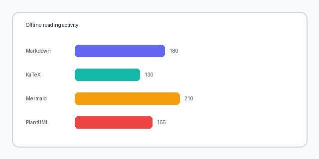
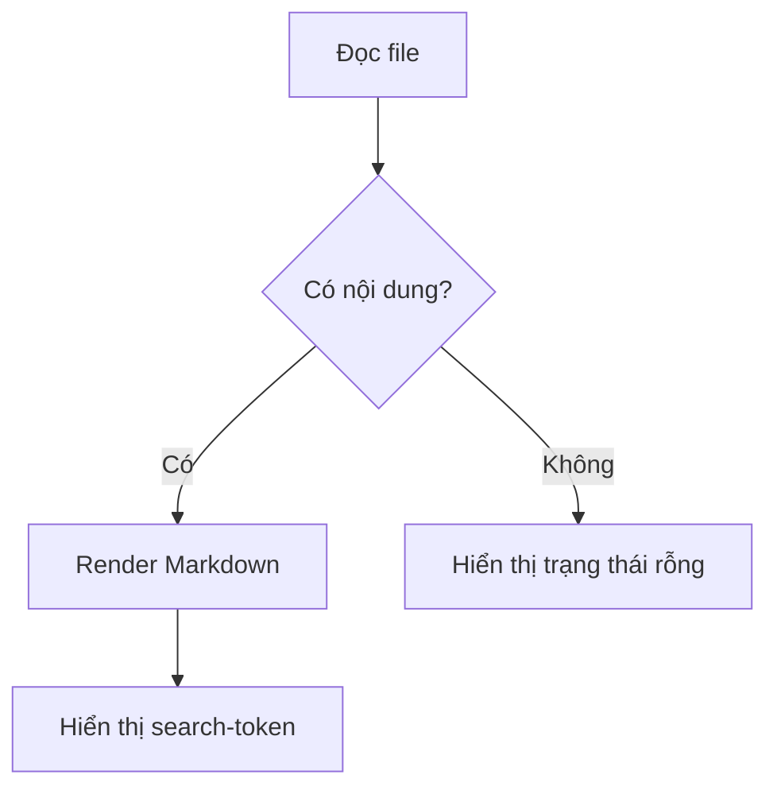
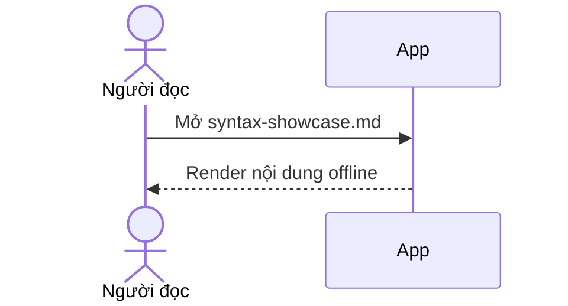
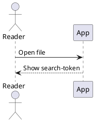
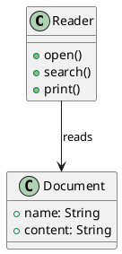

# Bộ kiểm thử cú pháp Notepad Viewer Plus

Đây là tài liệu tiếng Việt dùng để kiểm tra toàn bộ khả năng hiện có của trình
đọc. Nó được thiết kế để mở trực tiếp như **một file Markdown duy nhất** và
không cần mạng: biểu đồ, công thức, font KaTeX và grammar highlight đều chạy
trong bundle cục bộ. Từ khóa `search-token` xuất hiện nhiều lần để thử ô tìm
kiếm trong ứng dụng.

## 1. Markdown cơ bản và Unicode

### Một tiêu đề cấp ba

#### Một tiêu đề cấp bốn

##### Một tiêu đề cấp năm

###### Một tiêu đề cấp sáu

Văn bản có **đậm**, *nghiêng*, ***đậm và nghiêng***, ~~gạch bỏ~~, `inline code`,
emoji ☕, tiếng Việt có dấu, ký tự Hy Lạp αβγ, tiếng Nhật 日本語 và tiếng Ả Rập
العربية. Đây là một [liên kết an toàn](https://tauri.app/) và đây là một
[liên kết JavaScript bị chặn](javascript:alert(1)); liên kết nguy hiểm phải
hiện như văn bản không thể bấm.

> Đây là blockquote nhiều dòng.
>
> Nó giữ nguyên nội dung đọc được và vẫn chứa `search-token`.

---

Ký hiệu Markdown sau dấu gạch chéo ngược phải hiện nguyên dạng: \*không
nghiêng\*, \_không nhấn mạnh\_, \# không phải tiêu đề, và \| không phải dấu
phân cách bảng.

## 2. Danh sách, task và bảng

Danh sách có thứ tự, lồng nhau:

1. Mở ứng dụng.
2. Chọn file Markdown.
   1. Kiểm tra tiêu đề.
   2. Kiểm tra mục lục.
3. Tìm `search-token`.

Danh sách không thứ tự và task list:

- Đọc nội dung cục bộ.
  - Xem hình ảnh raster.
  - Xem các biểu đồ.
- [x] Kiểm tra Markdown cơ bản.
- [x] Kiểm tra công thức và callout.
- [ ] Thử in ra PDF bằng hộp thoại của hệ điều hành.

| Căn trái | Căn giữa | Căn phải |
|:---|:---:|---:|
| Markdown | KaTeX | PlantUML |
| Việt Nam | 日本語 | 123.45 |
| `search-token` | **đậm** | *nghiêng* |

## 3. Hình ảnh và HTML an toàn

Ảnh raster tương đối sau đây có sẵn bên cạnh tài liệu:



Ảnh ở xa sau đây cố ý không khả dụng; ứng dụng phải hiển thị fallback, không
được gửi yêu cầu tải ảnh ra mạng:


Raw HTML phải được hiển thị như văn bản đã escape, không được tạo phần tử hay
chạy script:

<span class="raw-html">HTML thô này chỉ là chữ</span>

<script>alert('script không được chạy')</script>

## 4. Công thức KaTeX ngoại tuyến

Công thức inline: $a^2 + b^2 = c^2$ và $\sqrt{x^2 + y^2}$.

Công thức block:

$$
\int_0^1 x^2\,dx = \frac{1}{3}
$$

Lệnh HTML không đáng tin cậy sau đây cố ý bị KaTeX từ chối nhưng lỗi phải nằm
gọn tại công thức: $\htmlClass{unsafe}{x}$.

Block math bị thiếu ngoặc cũng là lỗi có chủ đích:

$$
\frac{1}{2
$$

Đoạn này nằm ngay sau công thức lỗi; nếu vẫn nhìn thấy nó thì lỗi đã được cô
lập đúng vị trí.

## 5. Callout và nội dung lồng nhau

:::note
Đây là **note**. Văn bản trong callout vẫn là Markdown bình thường và vẫn tìm
được bằng `search-token`.

```text
Đây là fenced code bên trong note.
Marker đóng literal ::: không được đóng callout sớm.
:::
```

Sau fenced code, note vẫn tiếp tục cho đến marker thật.
:::

:::tip
Đây là **tip** với một danh sách ngắn:

- Mọi nội dung vẫn nằm trong article.
- Không có request tới server diagram.
:::

:::warning
Đây là **warning**. Hãy thử tìm `search-token` để kiểm tra nội dung callout.
:::

:::danger
Đây là **danger** dành cho lỗi hoặc cảnh báo quan trọng.
:::

:::future
Đây là admonition không được hỗ trợ. Source gốc phải hiện trong fallback nhìn
thấy được thay vì bị mất hoặc biến thành callout hợp lệ.
:::

## 6. Code highlighting: ngôn ngữ chính

Các fenced code dưới đây là những grammar được bundle và đăng ký trực tiếp.

### Bash

```bash
#!/usr/bin/env bash
set -euo pipefail
echo "offline search-token"
```

### CSS

```css
.article {
  color: var(--ink);
  padding: 1rem;
}
```

### JavaScript

```javascript
const searchToken = 'search-token';
console.log(`Found: ${searchToken}`);
```

### TypeScript

```typescript
type Result = { ok: boolean; count: number };
const result: Result = { ok: true, count: 3 };
```

### JSON

```json
{
  "offline": true,
  "features": ["math", "diagrams", "search-token"]
}
```

### Markdown

~~~markdown
# Tiêu đề trong code

**đậm**, *nghiêng*, và [liên kết](https://example.com)
~~~

### Python

```python
def render(token: str) -> str:
    return f"offline: {token}"

print(render("search-token"))
```

### Rust

```rust
fn main() {
    let token = "search-token";
    println!("offline: {token}");
}
```

### YAML

```yaml
offline: true
features:
  - math
  - diagrams
token: search-token
```

### XML / HTML

```xml
<reader mode="offline">
  <feature name="search-token" enabled="true" />
</reader>
```

## 7. Code highlighting: alias spot-check

Các alias bên dưới phải dùng cùng grammar với tên chính tương ứng.

```shell
echo "shell alias: search-token"
```

```sh
printf '%s\n' "sh alias: search-token"
```

```js
const javascriptAlias = true;
```

```ts
const typescriptAlias: boolean = true;
```

```md
**markdown alias**
```

```py
print("python alias")
```

```rs
fn alias() -> bool { true }
```

```yml
yaml_alias: true
```

```html
<p>HTML alias</p>
```

Ngôn ngữ không nằm trong allowlist phải vẫn an toàn và giữ dạng code thuần,
không highlight tùy tiện:

```brainfuck
<not-an-element> +++[>++++<-]>. search-token
```

## 8. Mermaid

### Flowchart



### Sequence diagram



### Mermaid lỗi có chủ đích

```mermaid
flowchart TD
    Start -->
```

Đoạn này phải vẫn hiển thị sau Mermaid lỗi. Lỗi của diagram chỉ nằm trong
diagram đó và không làm mất phần còn lại.

## 9. PlantUML

### Sequence diagram



### Class diagram



### PlantUML lỗi có chủ đích

```plantuml
@startuml
Alice ->
class
@enduml
```

Nội dung sau PlantUML lỗi vẫn phải đọc được. Hãy mở phần source của diagram
nếu cần kiểm tra thông báo lỗi cục bộ.

## 10. Kết luận và kiểm tra độ bền

Từ khóa `search-token` được lặp lại để kiểm thử tìm kiếm, điều hướng giữa các
kết quả và hiển thị số lượng match. Nếu bạn đọc được đến đây, các lỗi cố ý ở
math, Mermaid, PlantUML, ảnh từ xa và ngôn ngữ không xác định đều đã được cô
lập; chúng không được chặn đoạn văn cuối cùng này.

Đây là đoạn văn cuối để xác nhận failure locality: Notepad Viewer Plus vẫn
render được nội dung bình thường sau mọi ví dụ lỗi, giữ an toàn cho HTML/link,
và không cần kết nối mạng.
